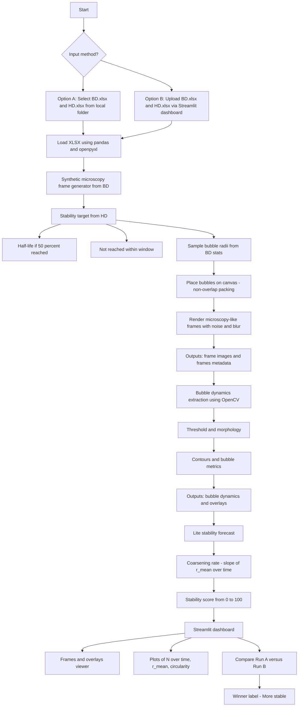

<p align="center">
  
</p>

<h1 align="center">Graph-O-Foam — ActiveScan Copilot (Lite)</h1>
<h3 align="center">XLSX Datasheets → Synthetic Microscopy Frames → Bubble Dynamics → Graph Digital Twin → ML Stability Forecast</h3>

<p align="center">
  <b>Microscopy Hackathon 2025 — AISCIA Use Case (adapted for petroleum fluids)</b>
</p>

<p align="center">

  <!-- Python -->
  

  <!-- Streamlit -->
  

  <!-- Pandas -->
  

  <!-- OpenPyXL -->
  

  <!-- NumPy -->
  

  <!-- OpenCV -->
  

  <!-- Scikit-ML -->
  

  <!-- FFmpeg -->
  

  <!-- Git -->
  

  <!-- GitHub -->
  

</p>

---

## 1) Problem Statement
Industrial petroleum fluids often produce unstable foams/emulsions where **bubble evolution** (coarsening, merging, deformation) determines performance and safety. In many real workflows, teams may not have labeled microscopy datasets — sometimes they only have **BD/HD datasheets (XLSX)**.

**Goal:** Build a fast, explainable, AI/ML-ready pipeline that transforms datasheets into microscopy-like frames, extracts bubble dynamics + graph-based digital twin metrics, and forecasts stability (half-life proxy), enabling GO vs NGO (or any condition A vs B) comparisons.

---

## 2) What Graph-O-Foam does (end-to-end)

### Phase-1 (Core pipeline)
1. **Ingest BD + HD XLSX**
   - **BD**: bubble statistics vs time (drives frame synthesis)
   - **HD**: foam stability signal (e.g., `Vfoam [mL]` / heights vs time)

2. **Generate synthetic microscopy frames**
   - samples bubble radii from BD stats
   - non-overlap placement / packing
   - renders microscopy-like images (noise/blur)

3. **Extract bubble dynamics (OpenCV)**
   - segmentation + contour analysis
   - per-frame: `n`, `r_mean`, `r_std`, `circularity`
   - saves verification overlays

4. **Stability estimate**
   - computes **half-life** when a 50% threshold is reached in the HD stability signal
   - if not reached: reports **“not reached within window”** (stable during the measured window)

### Phase-2 (Graph Digital Twin)
5. **Build bubble neighbor graph per frame**
   - adjacency via spatial proximity
   - exports `graph_metrics.csv` + overlay frames (`graph_overlays/`)

6. **Auto-create clip**
   - generates `graph_overlays.mp4` (+ optional GIF) from overlay frames

### Phase-2 (AI/ML compliance)
7. **ML model to forecast stability**
   - trains a baseline regressor (**RandomForest**) on extracted features across runs
   - uses early-window bubble + graph metrics to predict stability target (half-life proxy)

---

## 3) Outputs per run (in `data/synth/<run_name>/`)
- `frame_*.png` — synthetic microscopy frames  
- `bubble_dynamics.csv` — per-frame bubble dynamics  
- `overlays/` — bubble detection overlays  
- `graph_metrics.csv` — graph twin metrics  
- `graph_overlays/` — graph overlay frames  
- `graph_overlays.mp4` (+ optional `graph_overlays.gif`) — clip for quick demo  

> ✅ Phase-2 and ML use **only Phase-1 outputs** (`.png` + `.csv`) as source data.

---

## 4) Repo Structure
```text
Graph-O-Foam/
  demo/                     # Streamlit app (demo/app.py)
  src/
    synth/                  # XLSX → synthetic frame generator
    core/                   # bubble detection utilities
    tasks/                  # extract_dynamics, extract_graph_metrics, make_graph_overlay_clip
    ml/                     # ML training + inference
  data/
    uploads/                # Option B uploads (gitignored)
    sheets/                 # Option A local sheets (gitignored)
    synth/                  # generated runs (gitignored)
  assets/                   # README images (tracked)
  models/                   # trained ML model artifacts (tracked)
  requirements.txt
  README.md
  WRITEUP.md
```
---



## 5) Quickstart

### 5.1 Create environment & install dependencies
```bash
python -m venv venv
source venv/bin/activate
pip install -r requirements.txt
```

### 5.2 Run Streamlit
```bash
PYTHONPATH=. streamlit run demo/app.py
```

Open: http://localhost:8501

---

## 6) Inputs: Option A vs Option B
- **Option A (Recommended for repeatability):** pick BD/HD from `data/sheets/`
- **Option B (Upload in UI):** upload BD/HD XLSX in Streamlit  
  - run folder names are **sanitized** to avoid filesystem/FFmpeg issues (e.g., `[]`, spaces, etc.)

---

## 7) Train the ML baseline (optional but recommended)
```bash
PYTHONPATH=. python src/ml/train_model.py
```

Model artifact:
- `models/coarsening_rf.joblib`

---

## Follow-up Deliverables → `WRITEUP.md`

## Tools / Frameworks

Python 3.11, Streamlit, Pandas, OpenPyXL, NumPy, OpenCV (cv2), Git/GitHub.

---

## License

MIT

## Acknowledgments

- Thanks to entire TheChangeMakers team - "Atrerix"
- Inspired by Possibilities
- Microscopy Hackathon 2025 — AISCIA Use Case 


[]()
